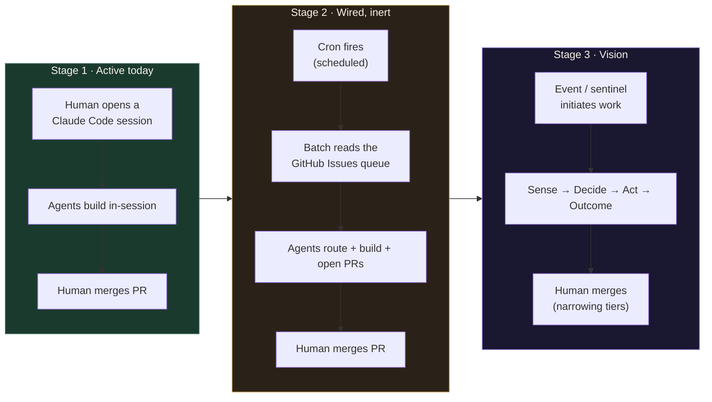
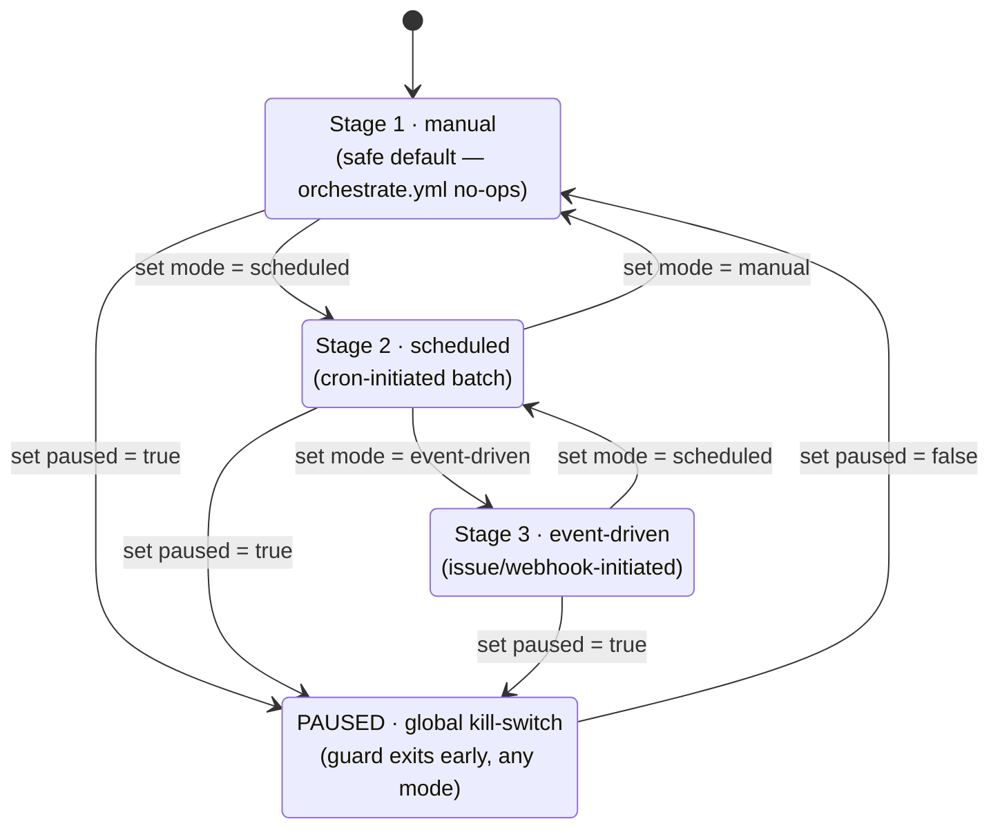
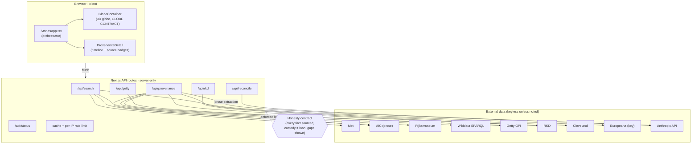
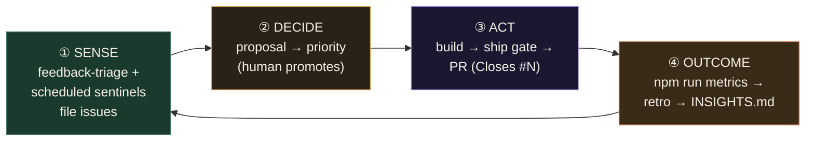
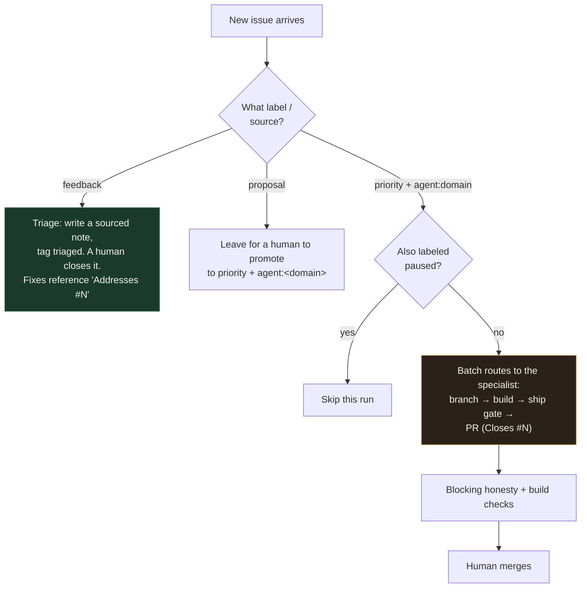

# How this project works — the Stage 1 → 2 → 3 workflow

_A tutorial for collaborators and a public, honest look at how Provenance Tracker is built. The
goal of making this transparent is better feedback and shared knowledge: this is one worked
example of running a small product with an AI agent team and GitHub as the project backbone._

This doc is the **single home** for the stage-evolution narrative and the operating runbook. It
links to the sources of truth rather than restating them:

- Rules & contract → [CLAUDE.md](../CLAUDE.md)
- Orchestration, routing, ship gate, git conventions → [AGENTS.md](../AGENTS.md)
- North star & why supervised autonomy → [docs/VISION.md](VISION.md)
- The autonomy decision → [docs/decisions/0002-stage3-autonomy-model.md](decisions/0002-stage3-autonomy-model.md)
- Branch-protection decision → [docs/decisions/0001-branch-protection-solo-dev.md](decisions/0001-branch-protection-solo-dev.md)
- What exists today → [docs/ARCHITECTURE.md](ARCHITECTURE.md)
- The one dial → [`.claude/orchestration.json`](../.claude/orchestration.json)

> The presentation-friendly version of this page is live at **`/workflow`** on the site.

---

## 1. The core idea: autonomy is a dial that turns up _initiation_, never _veto_

The whole model rests on one line from [ADR 0002](decisions/0002-stage3-autonomy-model.md):

> **autonomy is a dial, and the thing it turns up is _initiation_, never _veto_.**

Today a human initiates work (opens a session, promotes an issue, clicks merge). Each stage
removes the human as the _initiator_ of more of the loop, while keeping the human as the _gate_
on anything irreversible or outward-facing — merging to `main`, closing a visitor's issue,
publishing. That boundary never moves. Everything below is just how far the initiation dial is
turned.



| | **Stage 1 · Manual** | **Stage 2 · Scheduled** | **Stage 3 · Event-driven** |
|---|---|---|---|
| **Initiated by** | A human opening a session | A cron schedule | An event or a self-audit sentinel |
| **Work queue** | Whatever the session is about | GitHub Issues `priority` + `agent:<domain>` | Same queue, plus issues agents file themselves |
| **Who builds** | Agents you invoke | The batch squad, one per domain | The batch squad + scheduled sentinels |
| **Loops closed** | Act | Act | Sense → Decide → Act → Outcome |
| **Who gates** | Human merges | Human merges | Human merges (auto-on-green only for low-risk tiers) |
| **Status** | **Running** | Scaffolded, inert (`mode: manual`) | Designed; needs a budgeted runner |

The current default is the safe one: `mode: manual`. Stages 2 and 3 are **wired but inert** — the
[`orchestrate.yml`](../.github/workflows/orchestrate.yml) workflow exists, but its guard exits
early unless the dial says otherwise, and even then its run step is a STUB that executes no agents.

---

## 2. The one dial — `.claude/orchestration.json`

A single config file switches between stages with no code change. Two fields do the work:
`mode` (which stage) and `paused` (the global kill-switch). The
[`orchestrate.yml`](../.github/workflows/orchestrate.yml) guard reads them and no-ops unless
`mode` is `scheduled`/`event-driven` **and** `paused` is `false`.



Alongside `mode`/`paused`, the same file holds the **hard safety caps** — a per-run token budget
and a max-PRs-per-run ceiling — plus the per-risk-tier merge policy (`autonomy`) and the
sentinel/outcome toggles. Read the live values in
[`.claude/orchestration.json`](../.claude/orchestration.json); they are intentionally not copied
here so there is one source of truth.

---

## 3. The product being built (architecture in one picture)

The workflow above ships changes to a fairly simple Next.js app. The detailed inventory lives in
[docs/ARCHITECTURE.md](ARCHITECTURE.md); this is the shape of the data flow.



Key honesty invariant carried end to end: **custody (ownership) is never conflated with exhibition
loans**, every on-screen fact carries a visible source, and sparse data is shown as a gap rather
than filled in. These rules are enforced mechanically (see §5).

---

## 4. The four loops (what makes Stage 3 _improve_, not just _change_)

A system with only an **Act** loop can change the product but never learn. Stage 3 closes three
more loops so the next cycle is smarter, not just different. (Rationale and current wiring:
[ADR 0002](decisions/0002-stage3-autonomy-model.md).)



- **Sense** — work originates without a human typing it: visitor feedback auto-triage plus
  scheduled self-audit agents (`data-quality-sentinel`, `honesty-regression-sentinel`) that file
  issues themselves. These are **read-only on product code** — they route problems, they never fix
  them.
- **Decide** — a human promotes a `proposal` issue to `priority` + `agent:<domain>`. This is the
  deliberate separation of ideation from execution.
- **Act** — an agent builds and ships through the gate, opening a PR that says `Closes #N`.
- **Outcome** — `npm run metrics` writes an offline custody-chain health snapshot to
  `metrics/latest.json`; the `retro` agent turns merges + that snapshot into durable lessons in
  [docs/INSIGHTS.md](INSIGHTS.md). Today the Outcome loop's offline metrics step is live and runnable;
  the sentinels and `retro` automation are designed and toggled off (see the config).

---

## 5. GitHub as the project partner — how it works and how well it works

There is no separate project-management tool, no markdown task list, no kanban app. **GitHub is the
backbone**, and each part of it plays a specific role:

| GitHub feature | Role in this project |
|---|---|
| **Issues + labels** | The work queue and the only source of truth for "what to build" |
| **Projects board** | The phone-readable, at-a-glance view of that queue |
| **Actions** | The orchestration + the gates (honesty, build, metrics, security) |
| **Branch protection (ruleset)** | The enforcement that agents must PR and cannot merge |
| **Pull requests** | The unit of change; `Closes #N` makes the queue self-cleaning |

**Labels are the queue's grammar:**

- `priority` + `agent:<domain>` → a queued unit of work the batch squad will build
- `proposal` → a forward-looking idea, _not_ yet queued; a human must promote it
- `feedback` → an inbound visitor report; triaged, but only a human closes it
- `paused` → skip this one issue on the next batch run (per-item kill-switch)

When a new issue arrives, it is routed by its **source and property** (its label), not by guesswork:



**The gates that make this safe** (all in `.github/workflows/` + `scripts/`):

- **Honesty gate** (`npm run honesty` / `honesty-check.mjs`) — blocking on every PR. Greps the diff
  for over-claiming ("currently on view"-style live claims), speculative ownership, null-island
  coordinates, placeholder text, and missing source labels.
- **Build check** — `npm run build` must compile (TypeScript strict + lint).
- **Ship gate** (`scripts/ship.mjs`) — agents never `git commit` directly. Every commit goes
  through build → serve → live contract verify (`verify.mjs`) → commit-only-if-green. An agent's
  "I built X" is a _proposal_; the gate is the _result_.
- **Branch protection** — `main` requires a PR and the passing checks; no direct pushes; approvals
  are intentionally off for the solo maintainer (see [ADR 0001](decisions/0001-branch-protection-solo-dev.md)).

### Honest evaluation — where GitHub-as-partner shines and where it strains

**Strengths**
- **One source of truth.** The queue _is_ the issues; there is no second list to drift. `Closes #N`
  means merging cleans the queue automatically.
- **Auditable by construction.** Every change is a PR with a diff, linked to an issue, gated by CI.
  The history _is_ the documentation.
- **Free, hosted CI** runs the honesty/build/metrics gates on every PR with no extra infrastructure.
- **Phone-operable.** Promote, reorder, and merge from the GitHub mobile app; review the Vercel
  preview from a phone. The maintainer is never tied to a laptop to run the loop.

**Strains and limits (named honestly)**
- **Cost ceiling for autonomy.** Interactive Claude Code is covered by a plan; **headless CI agent
  runs are not**. That is the single reason Stages 2/3 stay inert — `orchestrate.yml` is a STUB
  until a budgeted runner exists.
- **No native budget enforcement.** GitHub won't stop a runaway agent loop; the token/PR caps live in
  the config and must be honored by the runner we build, not by GitHub.
- **Label discipline is load-bearing.** The whole routing model breaks if issues are mislabeled. A
  missing `agent:<domain>` label means an issue is invisible to the batch.
- **Issues aren't a great spec format** for rich, multi-part design work — those still want an ADR or
  a doc, with the issue pointing at it.

---

## 6. Operational runbook (rehearsed, safe drills)

Three things to practice live. Drill A is read-only and always safe. Drills B and C change config
on a branch only — never on `main` without a deliberate, reviewed merge.

### Drill A — Triage incoming issues by source/property (read-only)

The point is to route each issue by its label, not to fix anything in the moment. Walk the decision
tree in §5 against the live queue:

```bash
# list the open queue and read each issue's labels (read-only)
gh issue list --state open --json number,title,labels
```

Worked example — the queue at the time of writing held six issues, **all `feedback`**:

| # | Property | Routing decision |
|---|---|---|
| #60 | feedback · ux — "search by artist last name" | Genuinely useful → candidate to **promote** to `priority` + `agent:provenance-data` |
| #61 | feedback · general — "pricing page → about page" | Product-direction call → leave for a **human** to decide/promote |
| #64 | feedback · ux — "foldable learn sections, move legend" | Useful → candidate to **promote** to `priority` + `agent:provenance-globe` |
| #65 | feedback · ux — "hover link hard to click" | Reproducible bug → candidate to **promote** (`agent:provenance-globe`) |
| #67 | feedback · bug — "stale 'Overnight enrichment' copy on /team" | Real copy bug; this change set addresses it |
| #68 | feedback · bug — "Cassatt/Cézanne missing thumbnails" | Real data/asset bug; related to the 6→8 work additions |

The discipline: a `feedback` issue is an **inbound report** — agents triage and tag it, but **only a
human closes it**, and fixes reference it with `Addresses #N`, never `Closes #N`, so it can't be
auto-closed before a human verifies the fix. Promotion (`feedback`/`proposal` → `priority`) is
always a human action.

### Drill B — Turn Stage 2/3 on (safe dry-run)

To rehearse "going autonomous" without spending anything or merging anything live:

1. On a feature branch, flip the dial in [`.claude/orchestration.json`](../.claude/orchestration.json):
   `mode: "manual"` → `"scheduled"` (Stage 2) or `"event-driven"` (Stage 3), `paused: false`.
2. Confirm what _would_ happen by reading the guard in
   [`orchestrate.yml`](../.github/workflows/orchestrate.yml): with the dial flipped, the guard sets
   `run=true` — and the orchestrate job is still a **STUB that logs intent and executes no agents,
   uses no secrets, and writes nothing**. That is the proof the scaffold is inert by construction.
3. Run the one genuinely-live, free part of the Outcome loop:
   ```bash
   npm run metrics   # offline snapshot → metrics/latest.json, no API, no spend
   ```
4. **Revert the dial to `mode: "manual"` before opening the PR.** What merges to `main` always stays
   in the safe default.

**Real activation prerequisite (not done here):** replacing the STUB with a budgeted Claude runner
that respects `max_token_budget_per_run` and `max_prs_per_run`. Until that exists and is funded, the
dial is a design switch, not a live one. See ADR 0002 "Consequences."

### Drill C — Return to a safe state (pause)

Two independent kill-switches, smallest blast radius first:

- **Per-item:** add the `paused` label to one issue → the batch skips just that issue next run.
- **Global:** set `paused: true` (and/or `mode: "manual"`) in
  [`.claude/orchestration.json`](../.claude/orchestration.json) → the `orchestrate.yml` guard exits
  early in any mode and no agents run.

The invariant that holds even at maximum autonomy: branch protection + the blocking honesty gate +
a human merge always stand between an agent and `main`. The safe resting state of the dial is
`mode: manual`, `paused: false` — which is exactly where it sits today.

### Batch-day routine (the recurring Stage-2 cadence)

Stage-2 batches run **interactively** (covered by the Max plan). There is **no unattended scheduler**
until a funded headless runner exists (Drill B) — and Claude Code's own scheduled tasks only fire
while a session is alive, so they can't run an overnight batch. The recurring cadence is therefore a
**ritual you trigger**, with the reminder living _outside_ Claude (phone/calendar) so it fires even
when no session is open.

**Cadence:** trigger a batch when **≥2–3 ready priorities** have stacked up, or on a fixed day (e.g.
weekly) — not per issue.

**Pre-flight (before each batch):**
1. **Queue hygiene** — every `priority` issue has an `agent:<domain>` label (no label → silently
   skipped) and a real "Done when". Add `paused` to anything you want held.
2. **Close finished issues** so they leave the queue.
3. **Sync local main to origin** (the batch does this first; a stale main rebuilds already-merged work).

**Run:** open a session and run `/workflow batch-agent-squad` (or ask it to run a scoped batch). It
fans out one agent per domain → branch → build → honesty → PR `Closes #N` → honesty-gate review.

**Post-run:** review each PR's Vercel preview, merge the approved ones; blocked PRs stay open for the
agent to re-push; close the originating `feedback` issue by hand.

**Reminder to set in your phone/calendar (not Claude):**
> _Weekly — Provenance Tracker batch day:_ check the `priority` queue (≥2 ready?), run
> `/workflow batch-agent-squad`, review the Vercel previews, merge the approved PRs.

---

## 7. Using this as the project grows

- **Add work** by opening an issue. An idea → `proposal`; a decision to build → `priority` +
  `agent:<domain>`. Don't keep a side list; the issue _is_ the queue.
- **Add a capability** by adding (or sharpening) an agent profile in `.claude/agents/` and routing to
  it with an `agent:<domain>` label. The team grows by adding specialists, not by widening any one
  agent.
- **Turn the dial up** only when a budgeted runner exists; until then, run Stage 1 sessions and use
  Drill B to rehearse.
- **Keep the loops closed** — let the Outcome loop (`npm run metrics` + `retro` → INSIGHTS.md) feed
  the next cycle, so lessons compound instead of being re-derived.
- **Never spend the credibility moat.** The honesty gate stays blocking and the
  `provenance_data` / `globe` / `honesty_surface` tiers stay human-merged forever, regardless of how
  far the dial is turned.
