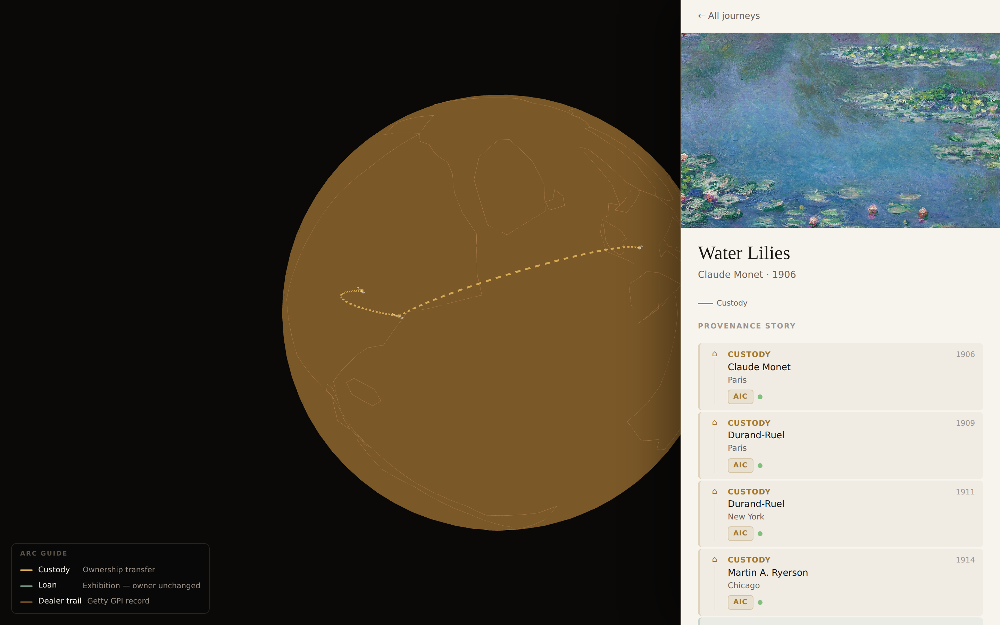

# Screenshot & live-demo shot list

The decks (`index-en.html`, `index-ko.html`) embed real screenshots from `assets/`. A few moments
need **live** capture from the deployed site, because museum APIs (AIC/Met) are blocked on
localhost, so a populated custody chain and the globe arcs only render against the live data.

## ✅ Already captured (in `assets/`, auto-captured via Playwright)

| File | Page / state | Used on slide |
|---|---|---|
| `home-globe.png` | `/` landing — gallery of 8 works + globe + arc legend | Demo · the landing |
| `detail-water-lilies.png` | `/` → Water Lilies detail panel (honest gap state, sources, "Spot an error") | Demo · what makes it different |
| `top-team.png` | `/team` top fold — "Autonomous by design", Stage 1/2/3, intake lanes | The roster is a real page |
| `top-workflow.png` | `/workflow` top fold — three stages of autonomy | The autonomy dial |
| `top-pipeline.png`, `top-learn.png`, `top-demo.png`, `top-pricing.png` | top folds of those pages | spare / optional |
| `page-*.png` | full-page captures of demo/team/learn/pipeline/workflow/pricing/feedback | spare / optional |
| `live-water-lilies.png` | Water Lilies populated custody chain — gold globe arc Paris→NY→Chicago + dated AIC timeline | Demo · the journey, live |
| `live-getty-degas.png` | Degas Yellow Dancers — Getty **GPI** dealer cards (seller→buyer, price, date) + 1963 museum acq. | Demo · the dealer layer |

> **Note on the two `live-*` shots.** Captured locally by injecting the repo's own real
> pre-parsed data (`featured-provenance.json`) and real seeded Getty records into the page,
> bypassing only the network-blocked museum *metadata* fetch. The data shown is genuine — the
> same the deployed site renders. If you want pixel-fresh captures from production, re-shoot them
> live (steps below); otherwise these are ready to use.

## ◷ Re-capture from the live site (optional — the two above are already embedded)

Open the **deployed** app (Vercel) — not localhost — so the museum APIs resolve.

1. **Populated custody chain — "Demo · the journey, live"**
   - Home page → click **Water Lilies** (Monet). Wait for the **gold custody arcs**
     Paris → New York → Chicago and the dated sidebar timeline. Capture the full window.
   - *Alternatives if thin live:* **Cézanne — The Basket of Apples** or **Cassatt — The Child's Bath**.

2. **Getty GPI dealer record — "Demo · the dealer layer"**
   - Open **Degas — Yellow Dancers**. Scroll the sidebar to the **Getty GPI** dealer cards
     (seller, buyer, price, date, purple **GPI** badge). Capture them.

3. *(Optional)* **GitHub board — "the cleanup turn"**
   - A screenshot of the repo **Issues** list or **Projects** board showing the label grammar
     (`priority`, `proposal`, `feedback`, `paused`). Replaces the `⎇` placeholder.

4. *(Optional, for the live talk)* **Live multi-museum search**
   - Type an artist (e.g. "Monet") in the search bar to show results streaming in from Met /
     AIC / Rijksmuseum / Cleveland / Wikidata, each with its source. Good as a live moment
     rather than a static shot.

## How to drop a captured image in

Save the PNG into `assets/` (e.g. `assets/live-water-lilies.png`), then on the relevant slide
replace the `<div class="placeholder">…</div>` block with:

```html
<div class="shot-frame">
  
  <p class="caption">Paris → New York → Chicago · gold custody arcs · dated timeline</p>
</div>
```

The same edit applies to both `index-en.html` and `index-ko.html` (same asset, different caption).

## Re-capturing the auto shots

The capture scripts live in the scratchpad; to regenerate, run the dev/prod server
(`PORT=3100 npm start`) and a Playwright script pointed at it (Chromium at
`/opt/pw-browsers/chromium-1194/chrome-linux/chrome`). Viewport 1440×900, deviceScaleFactor 2.
